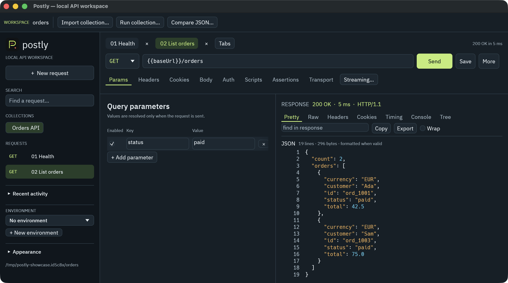

<div align="center">


# Postly — a native API workspace for your repo

### Import a collection. Inspect real responses. Run the same requests from your terminal.

Build requests. Inspect real responses. Commit the workflow with your code.

<p>
  <a href="https://github.com/OthmaneBlial/Postly/stargazers"></a>
  <a href="https://github.com/OthmaneBlial/Postly/blob/main/LICENSE"></a>
  <a href="https://www.rust-lang.org/"></a>
  <a href="docs/progress.md"></a>
</p>

<p>
  <a href="#quick-start">Try the local example</a> ·
  <a href="https://othmaneblial.github.io/Postly/">Open the project site</a> ·
  <a href="https://othmaneblial.github.io/Postly/docs.html">Read the docs</a> ·
  <a href="docs/migration-from-postman.md">Migrate from Postman</a> ·
  <a href="docs/compatibility.md">See compatibility</a> ·
  <a href="docs/progress.md">Read the evidence</a>
</p>

</div>

[](https://othmaneblial.github.io/Postly/#demo)

Actual macOS capture of the redesigned source preview. The older `v0.1.0`
download does **not** include this UI, onboarding or the new desktop workflows.

Postly is an open-source **API client**, **REST client** and **API testing
workspace** for developers who want their requests, collections and environments
to stay under their control. It is a practical **Postman alternative without an
account**: local project files, a native Rust core, a headless CLI and a desktop
workspace that share the same request model.

> **The idea:** your API client should help you ship the API — not become another
> cloud workspace that your API depends on.

## What Postly offers

| If you care about… | Postly gives you… |
| --- | --- |
| Privacy and ownership | A local-first workflow with no account wall, no mandatory cloud workspace and no request upload to a Postly service. |
| Git-native API work | Human-readable TOML collections, one request per file, deterministic discovery and ordinary `git diff`. |
| A focused developer tool | A native Rust/egui desktop app and a CLI built on the same core instead of an Electron-only workflow. |
| Postman migration | Collection v2.1 and environment import/export with diagnostics for unsupported or ambiguous fields. |
| Repeatable testing | Saved requests, environments, assertions, scripts, iteration data, folder runs and JSON/JUnit reports. |
| Modern protocols | REST/HTTP, GraphQL, SSE, WebSockets, OpenAPI and dynamic gRPC — in one local workspace. |

Postly is early and ambitious. Compatibility is published as executable evidence,
not as a “100% compatible” badge. Check the [compatibility matrix](docs/compatibility.md)
before moving a critical workflow.

## What works today

This repository contains working vertical slices, not a static interface mockup.

- **HTTP and REST:** GET, POST, PUT, PATCH, DELETE, HEAD, OPTIONS and custom
  methods; query parameters, duplicate headers, cookies, redirects, compression,
  timeouts, cancellation, raw/JSON/form/multipart/file bodies and response metadata.
- **Authentication:** Basic, Digest, Bearer, API key, OAuth 2.0 Client Credentials,
  Authorization Code + PKCE, Refresh Token and Device Authorization Grant,
  plus buffered AWS Signature V4 signing; including variable resolution,
  opt-in loopback browser login, bounded approval polling and local
  expiry-aware token caching.
- **Privacy-aware environments:** plain values stay in ignored local files;
  `postly env set --secret` stores new values in the OS credential store and keeps
  only an opaque workspace-scoped reference in the project; `--secret-stdin` and
  explicit legacy-secret migration avoid putting values in shell arguments. The
  native GUI can create, edit, disable and rename environments; existing secret
  references stay masked and new secret values go through the OS credential store.
- **Transport controls:** explicit insecure-TLS opt-in for supported HTTP and
  WebSocket flows,
  verified HTTPS, custom PEM CAs, combined PEM or password-protected PKCS#12
  client identities, HTTP(S)/SOCKS
  proxy routing, CLI/GUI WebSocket and gRPC HTTP CONNECT routing, WebSocket
  custom CA/client-identity support, native GUI exact-host/wildcard
  certificate associations, environment proxy support
  and bypass rules, per-request redirect/cookie overrides, with actionable
  diagnostics.
- **Response inspection:** Pretty/Raw views with JSON, YAML and well-formed XML
  formatting, detected JSON/YAML/XML/HTML/JavaScript/Text previews with lightweight
  syntax coloring, status/headers/cookies/protocol/duration, local search,
  TTFB/download timing where measurable, wrapping, clipboard copy, virtualized rendering, an in-app developer console,
  response snapshots and save-as-example fixtures for local mocks. Buffered
  HTTP responses are bounded to 100 MiB by default and can be tuned in the GUI
  Transport settings; streaming endpoints remain progressive and bounded by
  their live history views.
- **Collections:** local TOML projects, nested folders, deterministic discovery,
  stable request identity, duplicate/delete/rename flows, metadata-only history
  and workspace-wide request search. The native GUI supports multiple saved
  request tabs, dirty indicators, close-others, reordering and local tab
  restoration.
- **Migration:** Postman Collection v2.1 and environment import/export, explicit
  `.env` import with opt-in keychain storage, OpenAPI 3.0/3.1 JSON/YAML import
  with guarded local references, and cURL paste/copy.
- **API documentation:** generate deterministic local Markdown from collections,
  request descriptions, parameters, headers and response-example metadata.
- **OpenAPI export:** turn a native collection into OpenAPI 3.0 JSON or YAML,
  with explicit warnings and x-postly extensions for lossy cases.
- **Project site:** a responsive, dependency-free static showcase with SEO
  metadata, JSON-LD, reduced-motion support and source-backed navigation.
- **Code snippets:** generate reviewable cURL, JavaScript fetch, Python
  requests, Rust reqwest, Go, Java, C# and PHP from the same saved request
  model.
  - **Testing and automation:** response assertions, an opt-in Node.js script
  bridge, tested `pm.*` behavior including request/body facades and bounded
  `pm.sendRequest` callbacks, collection runs, folder selection, iteration
  data from JSON or CSV files, bounded script-free concurrency, fail-fast
  execution, pretty/JSON/JUnit reporters and a deterministic local HTTP mock
  server backed by saved response examples.
- **Modern API protocols:** structured GraphQL with schema introspection, SSE
  subscriptions, WebSocket text/binary flows with saved message presets, and
  dynamic gRPC calls with local `.proto` discovery or CLI server reflection (v1
  with v1alpha fallback).
- **Native desktop workspace:** request editing, dedicated raw text/JSON/XML/
  HTML/JavaScript body modes, Scripts and Body tabs, command palette,
  cancellation, local history, transport settings, dark/light/system themes and
  the same core semantics as the CLI.

The [living progress log](docs/progress.md) records what is implemented, what was
verified locally and which release gates still require external validation.

## Project site

Postly has a dependency-free public showcase and documentation hub at
[`othmaneblial.github.io/Postly/`](https://othmaneblial.github.io/Postly/), with
responsive layout, accessible navigation, protocol highlights and honest links
back to the versioned source documentation. The source lives in
[`website/`](website/) and can be previewed locally with:

```bash
python3 -m http.server 4173 --directory website
```

The [documentation hub](https://othmaneblial.github.io/Postly/docs.html)
organizes the guides for setup, migration, protocols, scripting, privacy and
compatibility.

## Download

The older technical preview is available for macOS Apple Silicon:
[`v0.1.0`](https://github.com/OthmaneBlial/Postly/releases/tag/v0.1.0). Verify
the included `SHA256SUMS` file before running the binaries. Cross-platform
installers, notarization and production release validation remain open.
The current source targets `0.2.0-preview.1`; its macOS app/DMG has local
packaging evidence, not a confirmed new public release. See the
[installation guide](docs/install.md) and [candidate report](docs/release-validation-v0.2.0-preview.1.md).

## Quick start

### 1. Build the current preview

Rust **1.95.0** is pinned in this repository. Initial compilation time depends
on your machine; the example itself needs no account or external API.

```bash
git clone https://github.com/OthmaneBlial/Postly.git
cd Postly

cargo build --locked --workspace
cargo run -p postly-app
```

### 2. Try the real local API

Choose **Try the example**, then an empty folder. Send **01 Health** to get
HTTP 200, then **02 List orders** to see two paid orders. Change `paid` to
`pending`, send again, and save the request. Use **Run collection** to execute
the saved requests and native assertions. The example server runs while that
desktop session stays open.

### 3. Use the same workspace from the terminal

Or create the starter from the CLI and leave its server running:

```bash
cargo run -- demo ./orders-demo --port 3979
```

In another terminal, from the repository root:

```bash
cargo run -- run ./orders-demo
cargo run -p postly-app -- ./orders-demo
```

The desktop app and CLI read the same local project. There is no signup step and
no hosted workspace is required for the core workflow.
The unchanged starter passes two requests and five assertions. See the
[complete Orders walkthrough](examples/orders/README.md) for Git diffs,
restarting the server, mocks and Postman import. Node.js is optional and only
needed for the opt-in Postman script bridge.

## From Postman to a Git-native API project

Export your collection and environment from Postman, then import them locally:

```bash
cargo run -- import collection ./collection.json --output ./my-api
cargo run -- import environment ./environment.json --output ./my-api --secure

cargo run -- list ./my-api
cargo run -- run ./my-api --environment Local --reporter pretty
```

Postly preserves supported folders, URLs, parameters, headers, bodies, auth,
variables, examples and script source. Unsupported or ambiguous fields are
reported for review instead of being silently presented as compatible.

The resulting project is designed to live beside the API it exercises:

```text
my-api/
├── postly.toml
├── collections/
│   └── my-api/
│       ├── postly.collection.toml
│       └── requests/
│           ├── health.postly.toml
│           └── users/
│               └── list-users.postly.toml
└── environments/
    └── local.postly-env.toml
```

```bash
git diff
git status
postly list .
```

Keep secrets out of Git with local environment files and the OS credential store.
Postly’s ignored `.postly/` artifacts contain bounded metadata-only history and
optional response snapshots plus a bounded GUI multi-draft recovery snapshot;
canonical request files remain ordinary project data. Recovered drafts are
always reopened as unsaved work and can be discarded explicitly.
Read the [Postman migration guide](docs/migration-from-postman.md) for the exact
import boundary.

## The CLI for developers and automation

Use `postly` for quick probes, saved requests and self-hosted CI workflows:

```bash
# One-off REST request
postly request https://api.example.com/users --bearer "$API_TOKEN"

# Saved request with a local environment
postly send ./my-api/collections/my-api/requests/health.postly.toml \
  --environment Local

# Deterministic collection or folder run
postly run ./my-api --environment Local --reporter json
postly run ./my-api --folder auth --environment Local --reporter junit > postly-results.xml

# Search request metadata without indexing secrets or payloads
postly search payments --workspace ./my-api --output-json

# Generate a code snippet without materializing secret references
postly snippet ./my-api/collections/my-api/requests/health.postly.toml \
  --language python

# Serve saved response examples locally for offline development
postly mock ./my-api --port 3000
```

During development, `cargo run --` is equivalent to `postly`. Exit status is
non-zero when a request, assertion, script test or runner operation fails.

## Protocols without a second tool

```bash
# GraphQL
postly graphql https://api.example.com/graphql \
  --query 'query { health }'

# Server-Sent Events
postly sse https://api.example.com/events --reconnect 3

# WebSocket
postly websocket wss://api.example.com/socket --send '{"type":"ping"}'

# gRPC from a local proto or a reflected server
postly grpc describe ./api.proto
postly grpc reflect https://api.example.com:443 --output-json
postly grpc call https://api.example.com:443 \
  --proto ./api.proto \
  --method /demo.Echo/Echo \
  --message '{"message":"hello"}'
# Explicit HTTP CONNECT proxying also works for CLI gRPC calls
postly grpc call https://api.example.com:443 --proxy http://127.0.0.1:8080 \
  --proto ./api.proto --method /demo.Echo/Echo
```

See the focused guides for streaming semantics, TLS boundaries and current
limitations: [GraphQL](docs/graphql.md), [SSE](docs/sse.md),
[WebSockets](docs/websocket.md), [gRPC](docs/grpc.md) and the
[local mock server](docs/mock-server.md). See also
[code generation](docs/code-generation.md).

## A transparent security boundary

Postly is local-first, not a magic security sandbox.

- Core request work does not require an account or a Postly-hosted workspace.
- Request payloads are not uploaded to a Postly service by the current workflow.
- History is bounded and metadata-only; it excludes query values, headers,
  cookies, bodies, auth and response content.
- New `--secret` environment values use the OS credential store; the project
  keeps an opaque reference rather than the value.
- Imported scripts are opt-in and are not claimed to be sandboxed. Review script
  source, filesystem permissions, proxy settings and clipboard use before using
  production credentials.

See [privacy](docs/privacy.md), [authentication](docs/authentication.md),
[certificates](docs/certificates.md) and [proxy behavior](docs/proxy.md) for
the implementation boundary.

## Architecture in one view

```text
                 ┌──────────────────────┐
                 │  postly-app (egui)   │
                 │  native workspace    │
                 └──────────┬───────────┘
                            │ shared Rust core
                 ┌──────────▼───────────┐
                 │      postly-core     │
                 │ model · storage ·    │
                 │ HTTP · protocols ·   │
                 │ runner · scripting   │
                 └──────────┬───────────┘
                            │
                 ┌──────────▼───────────┐
                 │     postly (CLI)     │
                 │ probes · runs · CI   │
                 └──────────────────────┘
```

The shared core keeps GUI and headless execution aligned. Collections are
project files; secrets, history and response snapshots have explicit local
storage boundaries. See [architecture](docs/architecture.md) for the full model.

## Run the evidence locally

There are no GitHub Actions in this repository. The local validation entry point
keeps checks reproducible and makes failures visible before a release claim:

```bash
cargo xtask fmt
cargo xtask lint
cargo xtask test
cargo xtask check

# Local benchmark and fuzz smoke runs
cargo xtask compat
cargo xtask bench
cargo xtask fuzz

# Build ignored local artifacts with checksums
CARGO_PROFILE_RELEASE_DEBUG=0 cargo xtask package
```

On a constrained disk, use low-debug-info artifacts:

```bash
CARGO_BUILD_JOBS=1 \
CARGO_PROFILE_DEV_DEBUG=0 \
CARGO_PROFILE_TEST_DEBUG=0 \
CARGO_INCREMENTAL=0 \
cargo xtask check
```

The test suite covers import fixtures, filesystem round trips, variable
diagnostics, local HTTP/proxy/TLS/mTLS servers, GraphQL, SSE, WebSocket, gRPC,
cancellation, collection assertions and GUI worker state. See
[development](docs/development.md), [benchmarks](docs/benchmarks.md) and
[fuzzing](docs/fuzzing.md).

## Roadmap with a point of view

Postly is aiming at a sharp promise: a developer should be able to replace the
daily Postman workflow with a local, inspectable and automatable API project.

The highest-value next steps are:

- broaden tested Postman `pm.*` compatibility while keeping the script boundary
  explicit and resource-limited;
- finish deeper protocol-specific GUI tooling, richer response previews and
  accessibility;
- expand deterministic protocol fixtures, OpenAPI reference coverage and memory
  benchmarks;
- complete signing, packaging, notarization and external review before calling
  a public release production-ready.

The [progress log](docs/progress.md) is the source of truth. Postly does not use
invented speed claims, fake testimonials, fabricated user counts or “viral”
guarantees as a substitute for product evidence.

## Documentation

- [Architecture](docs/architecture.md)
- [Development and local validation](docs/development.md)
- [CLI reference](docs/cli.md)
- [Collections and environments](docs/collections.md)
- [Environment and variable guide](docs/environments.md)
- [Authentication](docs/authentication.md)
- [Scripting and `pm.*`](docs/scripting.md)
- [Developer console](docs/console.md)
- [History](docs/history.md)
- [Keyboard shortcuts](docs/shortcuts.md)
- [Cookies](docs/cookies.md)
- [Certificates](docs/certificates.md)
- [Proxy](docs/proxy.md)
- [GraphQL](docs/graphql.md)
- [SSE](docs/sse.md)
- [WebSockets](docs/websocket.md)
- [gRPC](docs/grpc.md)
- [OpenAPI](docs/openapi.md)
- [Local API documentation](docs/api-documentation.md)
- [Code generation](docs/code-generation.md)
- [Local mock server](docs/mock-server.md)
- [Postman migration](docs/migration-from-postman.md)
- [Privacy](docs/privacy.md)
- [Security model](docs/security.md)
- [Debugging](docs/debugging.md)
- [Compatibility status](docs/compatibility.md)
- [Project progress](docs/progress.md)

## Contributing

The best contributions make a real workflow more trustworthy:

1. Add a regression fixture for a real migration edge case.
2. Add a deterministic local protocol test.
3. Improve the desktop UX with a functioning core path behind it.
4. Document a limitation clearly enough that another developer can act on it.
5. Add a benchmark with hardware, revision and methodology recorded.

Keep `base/` local: it is an ignored research corpus and must never be committed.
Before opening a change, run the relevant local checks and explain which product
boundary the change improves.

## License

Postly is released under the [MIT License](LICENSE).

<div align="center">

### Keep the request. Keep the context. Keep control.

[Explore the repository](https://github.com/OthmaneBlial/Postly) ·
[Share a migration edge case](https://github.com/OthmaneBlial/Postly/issues) ·
[Star Postly](https://github.com/OthmaneBlial/Postly/stargazers)

</div>
